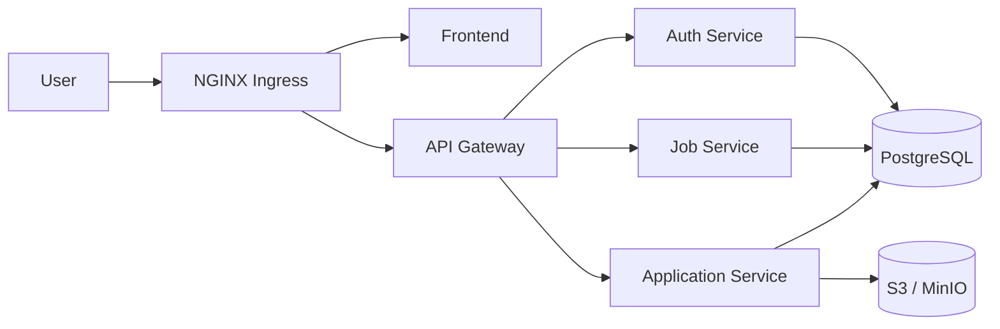

# ApplyHub Kubernetes Manifests

GitOps repository containing the Kubernetes deployment configuration for the
[ApplyHub](https://github.com/applyhub7/applyhub) microservices application.

This repository uses a reusable Helm chart and environment-specific values files
to deploy ApplyHub to development and production Kubernetes environments through
Argo CD.


## Architecture



| Service | Port | Description |
| --- | --- | --- |
| Frontend | 80 | Web interface for the ApplyHub platform |
| API Gateway | 4000 | Entry point that routes API requests to backend services |
| Auth Service | 4001 | Authentication and authorization |
| Job Service | 4002 | Job management |
| Application Service | 4003 | Job application management and object storage integration |

## Repository Structure

```text
apps-manifests/
├── applyhub/
│   ├── Chart.yaml
│   ├── values.yaml
│   └── templates/
│       ├── configmap.yaml
│       ├── deployment.yaml
│       ├── externalsecret.yaml
│       ├── hpa.yaml
│       ├── ingress.yaml
│       ├── pdb.yaml
│       └── service.yaml
└── env/
    ├── dev/
    │   ├── api-gateway.yaml
    │   ├── application-service.yaml
    │   ├── auth-service.yaml
    │   ├── frontend.yaml
    │   └── job-service.yaml
    └── prod/
        ├── api-gateway.yaml
        ├── application-service.yaml
        ├── auth-service.yaml
        ├── frontend.yaml
        └── job-service.yaml
```

The `apps-manifests/applyhub` directory provides a reusable Helm chart, while
`apps-manifests/env` contains values specific to each service and environment.

## Deployment Environments

| Environment | Image tag strategy | Infrastructure |
| --- | --- | --- |
| Development | Git commit SHA, such as `d584779` | Kubernetes PostgreSQL and MinIO |
| Production | Immutable semantic version, such as `v0.0.6` | Amazon RDS and Amazon S3 |

Development allows each successfully built commit to be deployed and traced back
to its source revision. Production uses immutable release versions for controlled
deployment and rollback.

## GitOps Deployment Flow

```text
Application source code changes
  |
  v
GitHub Actions builds Docker images
  |
  v
Images are pushed to Docker Hub
  |
  v
CI updates env/dev or env/prod values files
  |
  v
Argo CD detects the manifests commit
  |
  v
Kubernetes environment is synchronized
```

In development, image tags are updated under `apps-manifests/env/dev/` using the
short Git commit SHA. In production, release workflows update
`apps-manifests/env/prod/` using semantic version tags such as `v0.0.6`.

## Kubernetes Features

### Helm Chart

| Component | File | Purpose |
| --- | --- | --- |
| Chart metadata | `apps-manifests/applyhub/Chart.yaml` | Defines the reusable ApplyHub Helm chart |
| Deployment | `apps-manifests/applyhub/templates/deployment.yaml` | RollingUpdate strategy, resources, probes and environment references |
| Service | `apps-manifests/applyhub/templates/service.yaml` | Exposes workloads through ClusterIP Services |
| Ingress | `apps-manifests/applyhub/templates/ingress.yaml` | Defines HTTP routing and TLS secret naming |
| ConfigMap | `apps-manifests/applyhub/templates/configmap.yaml` | Provides non-sensitive application configuration |
| ExternalSecret | `apps-manifests/applyhub/templates/externalsecret.yaml` | Maps remote secret properties to Kubernetes Secrets |
| HPA | `apps-manifests/applyhub/templates/hpa.yaml` | Supports CPU and memory based autoscaling |
| PDB | `apps-manifests/applyhub/templates/pdb.yaml` | Defines disruption budget rules |

### Environment Values

| Area | Files | Purpose |
| --- | --- | --- |
| Development services | `apps-manifests/env/dev/*.yaml` | Service-specific values for the `dev` environment |
| Production services | `apps-manifests/env/prod/*.yaml` | Service-specific values for the `prod` environment |
| API routing | `apps-manifests/env/dev/api-gateway.yaml`, `apps-manifests/env/prod/api-gateway.yaml` | Routes `/api(/|$)(.*)` to the API Gateway with rewrite rules |
| Production availability | `apps-manifests/env/prod/api-gateway.yaml`, `auth-service.yaml`, `application-service.yaml`, `job-service.yaml` | Enables autoscaling and disruption budgets for backend workloads |

Production backend services use multiple replicas, autoscaling and disruption
budgets to improve availability during traffic changes, deployments and
voluntary cluster disruptions.

## Secrets Management

Sensitive values are not stored directly in this repository. The External
Secrets Operator retrieves secrets from AWS Secrets Manager through a
`ClusterSecretStore` and creates Kubernetes Secrets for the workloads.

| Component | File | Description |
| --- | --- | --- |
| ClusterSecretStore | `infrastructure/aws-connection/aws-sm-css.yaml` | Connects External Secrets Operator to AWS Secrets Manager |
| ServiceAccount | `infrastructure/aws-connection/eso-sa.yaml` | Service account used by External Secrets Operator |
| Service secrets | `apps-manifests/env/dev/*.yaml`, `apps-manifests/env/prod/*.yaml` | References remote secret keys and properties |

Examples of secret-backed values include database usernames and passwords, JWT
signing secrets and object storage credentials.

Secret paths are separated by environment:

```text
dev/applyhub/<service-name>
prod/applyhub/<service-name>
```

## Networking and TLS

NGINX Ingress exposes the frontend and API Gateway.

| Environment | Endpoint |
| --- | --- |
| Development | `https://applyhub-dev.noseyug.online` |
| Production | `https://applyhub.noseyug.online` |

TLS certificates are issued through cert-manager ClusterIssuers:

| Environment | File | ACME endpoint |
| --- | --- | --- |
| Development | `infrastructure/cluster-issuer/dev/letsencrypt-dev-ci.yaml` | Let's Encrypt staging |
| Production | `infrastructure/cluster-issuer/prod/letsencrypt-prod-ci.yaml` | Let's Encrypt production |

Internal communication between backend services uses Kubernetes ClusterIP
Services and cluster DNS.

## Data and Storage

| Environment | Database | Object storage |
| --- | --- | --- |
| Development | PostgreSQL StatefulSet in `infrastructure/databases/postgres/postgres-sts.yaml` | MinIO StatefulSet in `infrastructure/databases/minio/minio-sts.yaml` |
| Production | Amazon RDS endpoint configured in production service values | Amazon S3 endpoint and bucket configured in `apps-manifests/env/prod/application-service.yaml` |

## Monitoring

Monitoring-related values are stored in
`infrastructure/monitoring/values.yaml`.

| Component | Configuration |
| --- | --- |
| Grafana | Ingress, TLS host and persistent storage |
| Prometheus | Retention and persistent storage |

> TODO: Add dashboard, alert rule or ServiceMonitor details if those resources
> are managed outside the current repository structure.

## Render a Service Locally

Requirements:

- Kubernetes cluster
- Helm 3
- `kubectl`

Render the development Auth Service manifests:

```bash
helm template auth-service ./apps-manifests/applyhub \
  --namespace dev \
  --values ./apps-manifests/env/dev/auth-service.yaml
```

Install or upgrade the service manually:

```bash
helm upgrade --install auth-service ./apps-manifests/applyhub \
  --namespace dev \
  --create-namespace \
  --values ./apps-manifests/env/dev/auth-service.yaml
```

Validate the deployed resources:

```bash
kubectl get deployment,pod,service -n dev
```

In the normal deployment workflow, these operations are handled automatically by
Argo CD.

## Related Repository

Application source code:

- [applyhub7/applyhub](https://github.com/applyhub7/applyhub)

## Technology Stack

- Kubernetes
- Helm
- Argo CD
- GitHub Actions
- Docker Hub
- NGINX Ingress Controller
- cert-manager
- External Secrets Operator
- AWS Secrets Manager
- Amazon RDS
- Amazon S3
