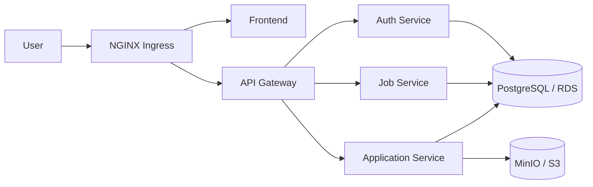

# ApplyHub Kubernetes Manifests

Kubernetes manifests repository for ApplyHub. It contains the Helm chart,
environment values and Argo CD application definitions used to deploy the
microservices to development and production environments.

## 📚 Table of Contents

- [✨ Highlights](#highlights)
- [🏗️ Architecture](#architecture)
- [🚀 Deployment Flow](#deployment-flow)
- [📁 Repository Structure](#repository-structure)
- [🌐 Environments](#environments)
- [🔄 Argo CD](#argo-cd)
- [⛵ Helm Chart](#helm-chart)
- [🔐 Secrets And TLS](#secrets-and-tls)
- [🗄️ Data And Storage](#data-and-storage)
- [🧪 Validate Locally](#validate-locally)
- [📝 Notes](#notes)
- [🔗 Related Repositories](#related-repositories)

<a id="highlights"></a>

## ✨ Highlights

- Argo CD app-of-apps deployment model.
- Reusable Helm chart for five microservices.
- Separate development and production values.
- NGINX Ingress routing with TLS certificates.
- External Secrets integration with AWS Secrets Manager.
- Dev PostgreSQL and MinIO running in-cluster.
- Production configuration for Amazon RDS and Amazon S3.
- Rolling updates, health probes, backend HPA and PDB for production workloads.

<a id="architecture"></a>

## 🏗️ Architecture



| Service | Port | Exposure |
| --- | --- | --- |
| `frontend` | 80 | `/` |
| `api-gateway` | 4000 | `/api(/|$)(.*)` |
| `auth-service` | 4001 | ClusterIP |
| `job-service` | 4002 | ClusterIP |
| `application-service` | 4003 | ClusterIP |

<a id="deployment-flow"></a>

## 🚀 Deployment Flow

```text
Source change
  -> GitHub Actions builds and pushes Docker image
  -> CI updates env values image tag
  -> Argo CD detects the manifests commit
  -> Argo CD renders Helm chart
  -> Kubernetes rolls out the service
```

Development uses short commit SHA image tags. Production uses immutable release
tags for controlled rollout and rollback.

<a id="repository-structure"></a>

## 📁 Repository Structure

```text
root-apps/                  # Argo CD root applications
argocd-apps/                # Argo CD child apps per service/env
apps-manifests/applyhub/    # Reusable Helm chart
apps-manifests/env/         # Dev/prod service values
infrastructure/             # Secrets, TLS, databases, monitoring
```

<a id="environments"></a>

## 🌐 Environments

| Area | Development | Production |
| --- | --- | --- |
| Namespace | `dev` | `prod` |
| Image tags | Commit SHA | Release tag |
| Domain | `applyhub-dev.noseyug.online` | `applyhub.noseyug.online` |
| Database | In-cluster PostgreSQL | Amazon RDS |
| Object storage | MinIO | Amazon S3 |
| Availability | Single-replica oriented | Backend HPA and PDB; frontend replicas and PDB |

<a id="argo-cd"></a>

## 🔄 Argo CD

The repo uses app-of-apps:

- `root-apps/dev/root-dev.yaml` syncs `argocd-apps/dev`.
- `root-apps/prod/root-prod.yaml` syncs `argocd-apps/prod`.
- Each child app deploys one service with the shared Helm chart.
- Values come from `apps-manifests/env/<env>/<service>.yaml`.
- Automated sync, prune and self-heal are enabled.

<a id="helm-chart"></a>

## ⛵ Helm Chart

The shared chart can create:

- Deployment
- Service
- Ingress
- ConfigMap
- ExternalSecret
- HorizontalPodAutoscaler
- PodDisruptionBudget

Defaults live in `apps-manifests/applyhub/values.yaml`. Service-specific
settings live in `apps-manifests/env/dev` and `apps-manifests/env/prod`.

<a id="secrets-and-tls"></a>

## 🔐 Secrets And TLS

External Secrets Operator pulls sensitive values from AWS Secrets Manager
through `infrastructure/aws-connection/aws-sm-css.yaml`.

Secret path pattern:

```text
dev/applyhub/<service-name>
prod/applyhub/<service-name>
dev/applyhub/database
```

cert-manager issues TLS certificates with DNS-01 validation through Cloudflare.

| Environment | Host | ClusterIssuer |
| --- | --- | --- |
| dev | `applyhub-dev.noseyug.online` | `letsencrypt-dev-ci` |
| prod | `applyhub.noseyug.online` | `letsencrypt-prod-ci` |

<a id="data-and-storage"></a>

## 🗄️ Data And Storage

Development includes in-cluster infrastructure:

- PostgreSQL StatefulSet in namespace `databases`.
- MinIO StatefulSet in namespace `databases`.
- Persistent volumes using StorageClass `gp3`.

Production values point services to Amazon RDS and Amazon S3.

<a id="validate-locally"></a>

## 🧪 Validate Locally

Render a service with Helm:

```bash
helm template auth-service ./apps-manifests/applyhub \
  --namespace dev \
  --values ./apps-manifests/env/dev/auth-service.yaml
```

Install manually if needed:

```bash
helm upgrade --install auth-service ./apps-manifests/applyhub \
  --namespace dev \
  --create-namespace \
  --values ./apps-manifests/env/dev/auth-service.yaml
```

<a id="notes"></a>

## 📝 Notes

- CI should update image tags in `apps-manifests/env/<env>/`.
- ExternalSecret resources require matching AWS secret keys/properties.
- Monitoring values exist under `infrastructure/monitoring/values.yaml`.

<a id="related-repositories"></a>

## 🔗 Related Repositories

[applyhub7/applyhub](https://github.com/applyhub7/applyhub) contains the
microservice source code, Dockerfiles and CI/CD workflows.
